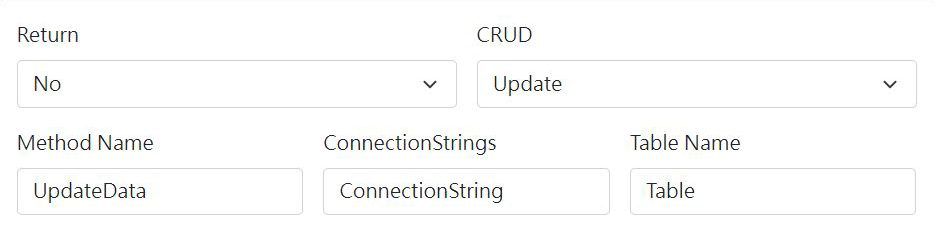
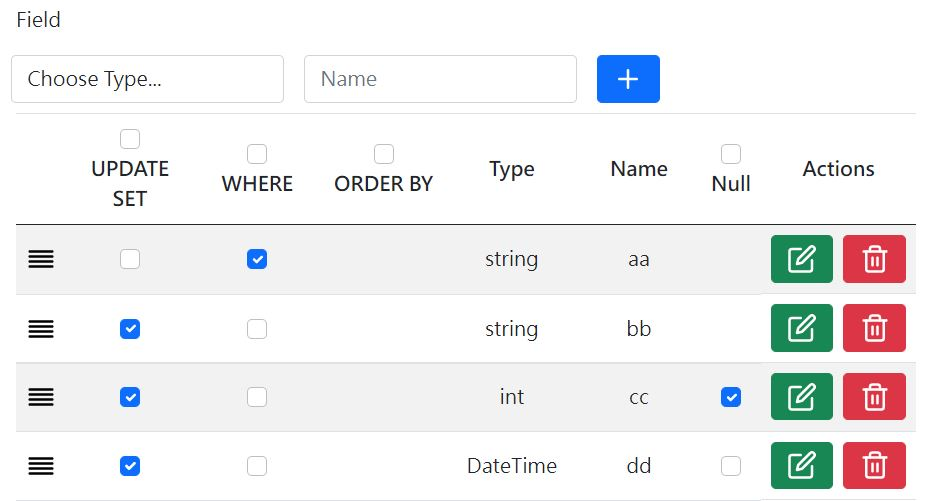

# Connect SQL
> #### This is a simple MySQL CRUD tool for ASP.NET Web Form.
## Usage

### Return
Select your function return type.
### CRUD
Select your SQL actions.
### Method Name
Input your function method name.
### ConnectionStrings
Input your web.config connectionStrings name.
### Table Name
Input your SQL Table name.
### Field
Add your SQL column name and data type

You can edit value or drag table row to sort it.

## Live Demos
https://laura-chou.github.io/connect_sql/